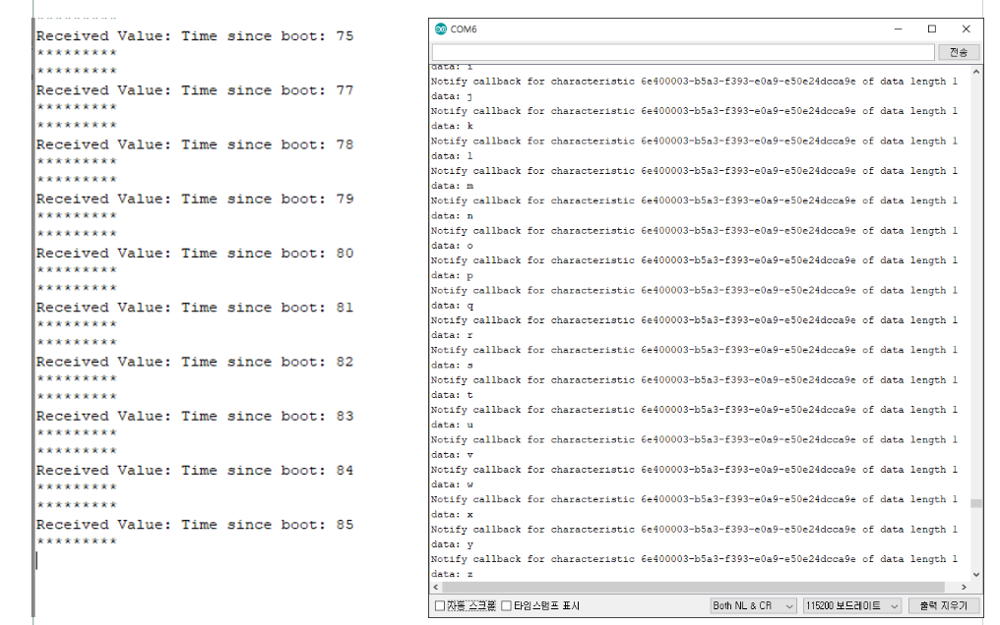

# ESP32 BLE uart client example

### BLE_uart_client (central)
- BLE_client 예제를 기준으로 작성됨

### BLE_uart_server (peripheral)
- BLE_uart 예제에서 추가된 코드 

### 동작 화면

### 관련 블로그 
https://blog.naver.com/chandong83/222054277831

